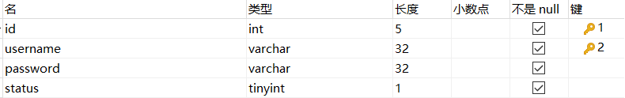

# SpringBoot_StudentManagerSystem

#### 介绍
基于SpringBoot2.0+Mybatis的学生成绩管理系统

一.功能分析

- （1）管理员：学生信息管理，班级信息管理，教师信息管理，课程信息管理，选课信息管理，考勤信息管理，请假信息管理，成绩信息管理，系统管理
- （2）老师：学生信息管理，班级信息管理，教师信息管理，课程信息管理，选课信息管理，考勤信息管理，请假信息管理，成绩信息管理，系统管理
- （3）学生：学生信息管理，选课信息管理，考勤信息管理，请假信息管理，成绩信息管理，系统管理

二.开发环境 

    Windows 10，IntelliJ IDEA 2020.2，mysql5.5
	
三.项目结构设计

- （1）java目录：java类文件，用于接受前端请求、后端逻辑控制等
- （2）resources目录：包含mapper（数据库操作的xml文件）、static（静态资源文件）、templates（前端html页面文件）、application.yml全局配置文件等
- （3）pom.xml文件：基于maven管理的jar包

四.项目讲解博客

https://blog.csdn.net/qq_39144436/article/details/123136969

五.数据库studentmanager设计：

- （1）管理员信息表s_admin

- （2）学生信息表s_student

- （3）老师信息表s_teacher

- （4）班级信息表s_clazz

- （5）课程信息表s_course

- （6）请假信息表s_leave

- （7）学生成绩表s_score

- （8）选课信息表s_selected_course

- （9）考勤信息表s_attendance 

